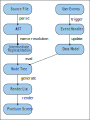

= Architecture Overview

This section provides an overview of the architecture of the codebase and explains the role of each component.

== Data flow from source UI definition in a file to pixels on the screen

The following shows the flow of the UI definition through the rendering process.

. *Source file*: The description of the UI is written in a source file.
. *AST*: This source file is parsed into an Abstract Syntax Tree (AST).
. *Intermediate Representation*: The AST is transformed into an Intermediate Representation (IR).
Symbol resolution and type checking can be done on this IR.
. *Data Model*: The data model captures the current state of the UIs domain model.
. *Node Tree*: The IR is merged with the data model to create a node tree.
Evaluation of case and expansion of for statements is performed in this step.
Layout is also performed on the node tree.
. *Render List*: The node tree is transformed into a list of primitive drawing commands.
. *Display*: The render list is rendered on the screen, using a rendering backend.
Current implementation uses the FEMTOVG or SVG.

